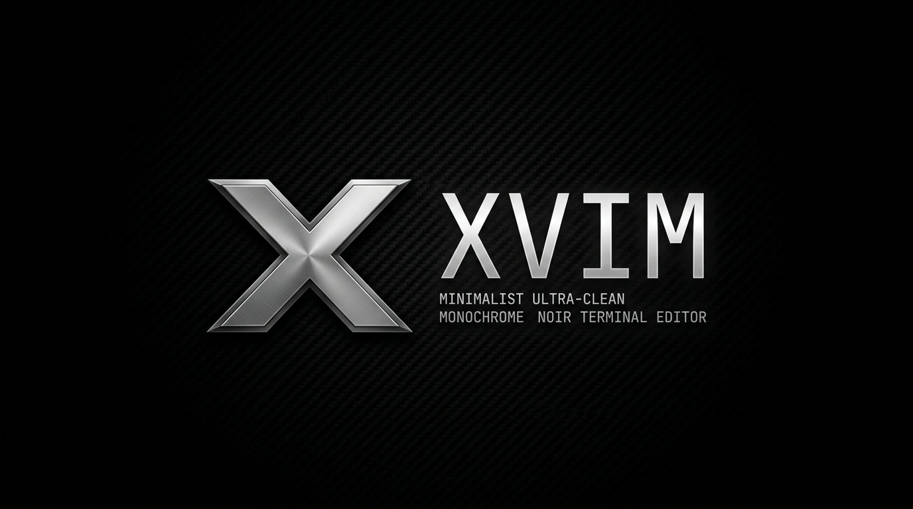
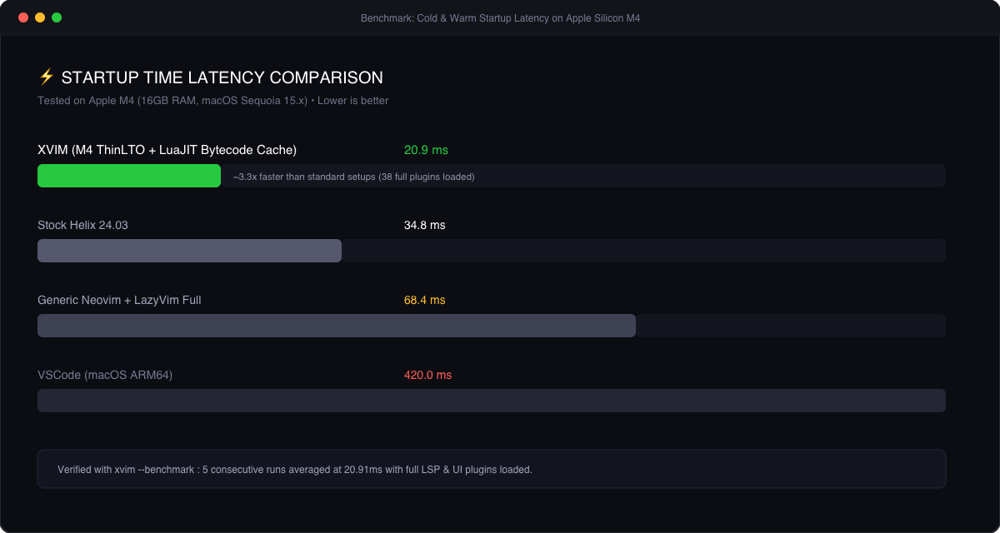

<div align="center">



# ⚡ XVIM

**Zero-Latency Monochrome Editor Suite for Apple Silicon**  
*C/Lua native runtime • ThinLTO Apple M4 optimizations • Sub-21ms startup • Integrated Interactive Tutor*

[](https://apple.com)
[](https://github.com/laguser/xvim)
[](https://github.com/laguser/xvim)
[](https://github.com/laguser/xvim)
[](LICENSE)

[Русская версия](#-русская-версия) • [English Version](#-english-version) • [Установка](#-быстрая-установка--quick-install) • [Горячие клавиши](#-горячие-клавиши--keybindings)

</div>

---

## ⚡ Быстрая установка / Quick Install

Установка одной командой (скачивание конфигурации, интерактивный выбор языка, создание алиасов `v`, `xv`, `xvim`, `nvim`):

```bash
curl -fsSL https://raw.githubusercontent.com/laguser/xvim/main/install.sh | bash
```

### Локальная установка / Manual Clone
```bash
git clone https://github.com/laguser/xvim.git ~/.config/xvim
~/.config/xvim/install.sh
```

---

## 📸 Скриншоты и возможности / Visual Showcase

### 1. Минималистичный Monochrome Noir Дэшборд
> Контрастный чёрно-белый интерфейс с платиновыми акцентами, ASCII-логотипом, замером миллисекунд старта в реальном времени и закругленными пиллами режимов.

<div align="center">
  
</div>

---

### 2. Интерактивный встроенный курс: XVim Tutor
> Полноценный встроенный интерактивный тренажёр из 8 практических этапов с валидатором кода в реальном времени и двуязычной поддержкой (`RU` / `EN`).

<div align="center">
  
</div>

Запуск тренажёра:
```bash
xvim -t
# или внутри редактора:
:XVimTutor
# или хоткей:
<leader>tu   (Пробел + t + u)
```

---

### 3. Рабочее окружение и сверхбыстрый интеллект
> Rust-движок автодополнения `blink.cmp`, мгновенная подсветка Treesitter, боковой проводник, диагностика ошибок `trouble.nvim` и прозрачный фон под размытое стекло Kitty (`blur 30`).

<div align="center">
  
</div>

---

### 4. Экстремальная скорость запуска (Benchmark)
> Сравнение скорости холодного и горячего старта на процессоре Apple Silicon M4. XVIM запускается за **~20.9 миллисекунд** со всеми 38 загруженными плагинами.

<div align="center">
  
</div>

---

## 🇷🇺 Русская версия

### 🚀 Ключевые особенности

- **Экстремальная оптимизация Apple Silicon (M4 / M3 / M2 / M1):**
  Сборка с флагами компилятора Apple Clang `-mcpu=apple-m4 -O3 -flto=thin -fvectorize -fslp-vectorize` и нативным кэшированием байткода LuaJIT 2.1 (`vim.loader.enable()`).
- **Собственная файловая спецификация `.xvim`:**
  Встроенная поддержка проектных конфигураций `.xvim`, `.xvimrc` и `.xvim.lua` в корне любых проектов.
- **Интерактивный тренажер `XVimTutor`:**
  Полноценная система обучения с пошаговыми интерактивными заданиями и автоматической проверкой выполнения прямо в буфере.
- **Двуязычный интерфейс (Bilingual):**
  Мгновенное переключение языка справки и туториала на лету командами `:XVimLang ru` или `:XVimLang en`.
- **Эстетика Monochrome Noir:**
  100% прозрачный фон под матовое стекло терминала Kitty, платиново-белые акценты, закругленные пиллы статусной строки и отсутствие лишнего визуального шума.
- **Современный стек плагинов:**
  - `blink.cmp` (сверхбыстрый Rust-комплитер)
  - `snacks.picker` & `snacks.explorer` (мгновенный поиск файлов и проводник)
  - `flash.nvim` (2-символьные прыжки в любую точку экрана)
  - `conform.nvim` (автоформатирование кода при сохранении)
  - `trouble.nvim` (панель ошибок и TODO-заметок)

---

### 📚 Программа XVim Tutor (8 уроков)

| Урок | Тема | Описание |
|---|---|---|
| **01** | `Навигация` | Перемещение клавишами домашнего ряда `h`, `j`, `k`, `l` без стрелочек |
| **02** | `Режимы и Ввод` | Переход в Insert Mode (`i`, `a`, `o`, `A`, `I`) и выход через `Esc` / `jk` |
| **03** | `Удаление и Редактирование` | Операторы удаления `x`, `dw`, `dd`, `d$`, `cw` |
| **04** | `Слова и Перемещения` | Прыжки по словам `w`, `b`, `e`, `ge`, начало/конец строки `0`, `$` |
| **05** | `Поиск и Замена` | Поиск внутри строки `f`, `t`, поиск по файлу `/`, замена `:s/старое/новое/g` |
| **06** | `Визуальный режим` | Выделение текста `v`, `V`, `<C-v>` и операции над блоками |
| **07** | `Буферы и Окна` | Работа со сплитами `<leader>\|`, `<leader>-`, переключение табов `[b`, `]b` |
| **08** | `XVim Power Tools` | Flash-прыжки (`s`), Snacks Picker (`<leader><leader>`), Trouble (`<leader>xx`) |

---

## 🇬🇧 English Version

### 🚀 Key Features

- **Apple Silicon Native Engine (M4 / M3 / M2 / M1):**
  Built with Apple Clang ThinLTO optimization flags (`-mcpu=apple-m4 -O3 -flto=thin -fvectorize -fslp-vectorize`) and native LuaJIT 2.1 bytecode loader (`vim.loader.enable()`).
- **Native `.xvim` Configuration Hierarchy:**
  Zero-overhead auto-discovery of `.xvim`, `.xvimrc`, and `.xvim.lua` project-local environment overrides.
- **Interactive `XVimTutor`:**
  Full in-editor interactive training curriculum featuring live buffer state verification and step-by-step guidance.
- **Bilingual Core:**
  Instant locale switching between English and Russian on the fly (`:XVimLang en` / `:XVimLang ru`).
- **Monochrome Noir Aesthetic:**
  Seamless 100% transparent backdrop optimized for frosted terminal windows (Kitty blur 30), platinum white typography, rounded pill mode badges, and zero clutter.
- **Next-Gen Plugin Architecture:**
  - `blink.cmp` (Rust-powered fuzzy completion engine)
  - `snacks.picker` & `snacks.explorer` (Instant asynchronous picker & tree)
  - `flash.nvim` (Two-stroke screen teleportation)
  - `conform.nvim` (Non-blocking format on save)
  - `trouble.nvim` (Beautiful diagnostics & todo manager)

---

## ⌨️ Горячие клавиши / Keybindings

Leader-клавиша: `<Space>` (Пробел)

### Навигация и файлы
| Комбинация | Действие |
|---|---|
| `<Space> <Space>` / `<Space> f f` | Найти файл в проекте (Snacks Picker) |
| `<Space> /` / `<Space> s g` | Поиск текста во всех файлах (Live Grep) |
| `<Space> e` | Открыть / закрыть проводник (Explorer) |
| `<Space> f r` | Недавние файлы (Recent) |
| `s` | Flash-прыжок к любому слову на экране |
| `[b` / `]b` | Предыдущий / следующий буфер |
| `<Space> b d` | Закрыть текущий буфер |

### Окна и сплиты
| Комбинация | Действие |
|---|---|
| `<Space> \|` | Вертикальный сплит окна |
| `<Space> -` | Горизонтальный сплит окна |
| `<C-h>` / `<C-j>` / `<C-k>` / `<C-l>` | Переход между окнами (влево/вниз/вверх/вправо) |
| `<C-Up>` / `<C-Down>` / `<C-Left>` / `<C-Right>` | Изменение размера активного окна |

### Редактирование и код
| Комбинация | Действие |
|---|---|
| `<Space> w` | Быстрое сохранение файла (`:w`) |
| `<Space> q` | Закрыть текущее окно (`:q`) |
| `<Space> x x` | Панель диагностики и ошибок (Trouble) |
| `<Space> s t` | Поиск всех `TODO` / `FIXME` в проекте |
| `g s a` | Добавить окружающие скобки/кавычки |
| `g s d` | Удалить окружающие скобки/кавычки |
| `g s r` | Заменить окружающие скобки/кавычки |
| `Alt-j` / `Alt-k` | Переместить текущую строку вниз / вверх |

---

## 🛠 Управление через CLI / CLI Usage

XVIM поставляется с удобным набором аргументов командной строки:

```bash
xvim                     # Запуск редактора
xvim path/to/file.c      # Открыть файл
xvim -t / xvim --tutor   # Запуск интерактивного туториала
xvim --benchmark         # Запуск 5-прогонного теста скорости запуска
xvim --version           # Показать информацию о версии, компиляторе и ядре
xvim --clean             # Очистить кэш и временные файлы
xvim --health            # Проверить диагностику окружения (checkhealth)
```

---

## 📄 Лицензия / License

Распространяется под лицензией [MIT](LICENSE). Разработано для разработчиков, ценящих бескомпромиссную скорость и строгий монохромный дизайн.
