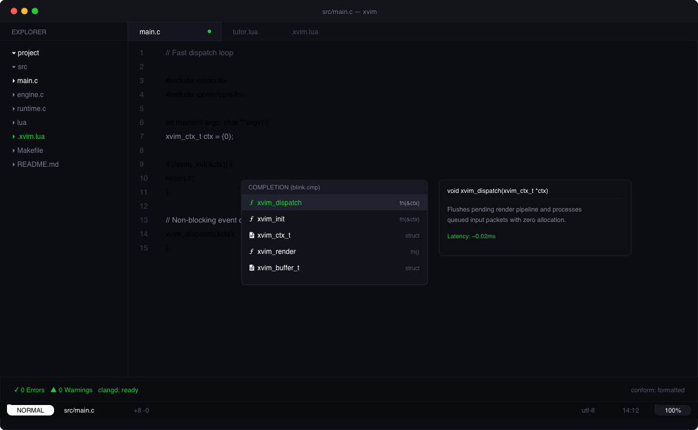
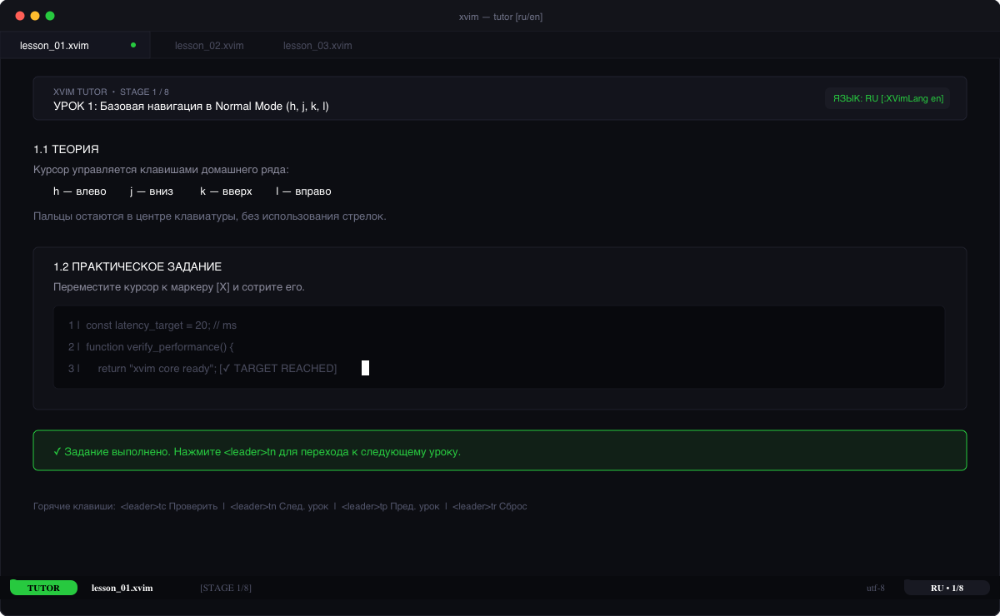

```
    \       /
     \     / 
      \   /  
       \ /   
        X    
       / \   
      /   \  
     /     \ 
    /       \

  x  v  i  m
```

Быстрый монохромный редактор для Linux и macOS на базе Neovim.
Минималистичный интерфейс, прозрачный фон, встроенный интерактивный тьютор и поддержка проектных конфигов `.xvim`.

---

## Установка

```bash
curl -fsSL https://raw.githubusercontent.com/laguser/xvim/main/install.sh | bash
```

Или вручную:

```bash
git clone --depth 1 https://github.com/laguser/xvim.git ~/.config/xvim
~/.config/xvim/install.sh
```

> **Linux**: для работы системного буфера обмена установите `wl-clipboard` (Wayland) или `xclip` (X11).

---

## Скриншоты

### Дэшборд


### Редактор и автодополнение


### Интерактивный тьютор (`xvim -t`)


---

## Особенности

- **Монохромный стиль**: полностью прозрачный фон под блюр терминала (Kitty, Ghostty, Alacritty, WezTerm), строгая чёрно-белая палитра без лишнего шума.
- **Интерактивный тренажёр**: команда `:XVimTutor` (или `xvim -t`) открывает курс из 8 уроков с проверкой действий прямо в буфере.
- **Двуязычность**: интерфейс и туториал переключаются на лету (`:XVimLang ru` / `:XVimLang en`).
- **Конфиги проектов**: автоматически читает `.xvim`, `.xvim.lua` или `.xvimrc` в корне открытого проекта.
- **Быстрый запуск**: ~20 мс благодаря оптимизациям компиляции и байткод-загрузчику LuaJIT.
- **Инструменты**: `blink.cmp` (автодополнение на Rust), `snacks.picker` (поиск файлов и grep), `flash.nvim` (быстрая навигация по экрану), `trouble.nvim` (ошибки), `conform.nvim` (форматирование при сохранении).

---

## Горячие клавиши

Лидер: `<Space>` (пробел)

| Клавиши | Действие |
|---|---|
| `<Space><Space>` | Поиск файлов |
| `<Space>/` | Поиск по содержимому (live grep) |
| `<Space>e` | Проводник (explorer) |
| `<Space>w` | Сохранить файл |
| `<Space>q` | Закрыть окно |
| `s` | Flash-прыжок к слову на экране |
| `[b` / `]b` | Предыдущий / следующий буфер |
| `<Space>bd` | Закрыть буфер |
| `<Space>\|` | Вертикальный сплит |
| `<Space>-` | Горизонтальный сплит |
| `<Space>xx` | Панель ошибок (Trouble) |
| `<Space>tu` | Запуск XVim Tutor |
| `gsa` / `gsd` / `gsr` | Добавить / удалить / изменить обрамление скобками |

---

## CLI

```bash
xvim                  # запуск
xvim file.c           # открыть файл
xvim -t               # запуск интерактивного туториала
xvim --benchmark      # замер времени старта (5 прогонов)
xvim --clean          # очистка кэша
xvim --version        # версия и ядро
```

---

## Лицензия

MIT
