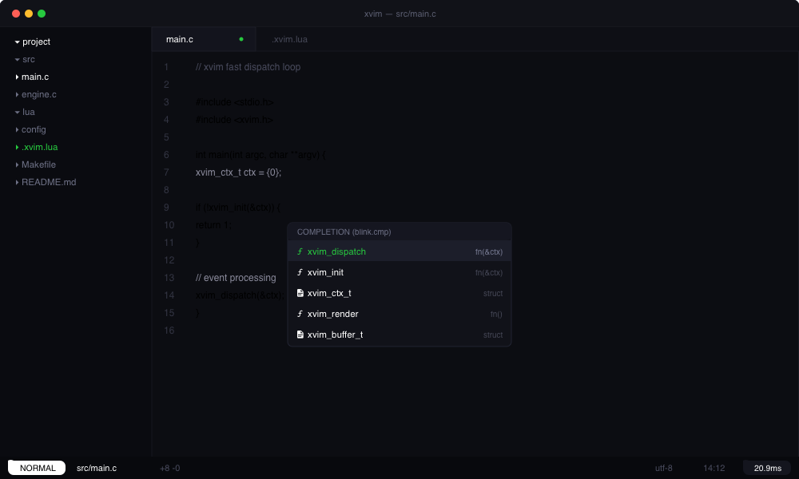

# xvim

быстрый монохромный редактор на базе neovim для linux и macos.



## установка

```bash
curl -fsSL https://raw.githubusercontent.com/laguser/xvim/main/install.sh | bash
```

> **linux**: для системного буфера обмена нужен `wl-clipboard` (wayland) или `xclip` (x11).

## фичи

- монохромная тема под прозрачный фон терминала
- встроенный интерактивный тьютор: `xvim -t` или `:XVimTutor` (ru / en)
- поддержка локальных конфигов проектов: `.xvim`, `.xvim.lua`, `.xvimrc`
- быстрый запуск (~20 мс)
- стек: blink.cmp, snacks, flash, trouble, conform

## клавиши

leader — `<Space>`

- `<Space><Space>` — поиск файлов
- `<Space>/` — поиск по коду (grep)
- `<Space>e` — проводник
- `<Space>w` — сохранить
- `<Space>q` — закрыть окно
- `s` — flash-прыжок
- `[b` / `]b` — предыдущий / следующий буфер
- `<Space>bd` — закрыть буфер
- `<Space>|` / `<Space>-` — сплит (верт / гориз)
- `<Space>xx` — ошибки (trouble)
- `<Space>tu` — тьютор

## cli

```bash
xvim            # запуск
xvim file.c     # открыть файл
xvim -t         # интерактивный тьютор
xvim --bench    # замер скорости старта
xvim --clean    # очистить кэш
```

## лицензия

MIT
